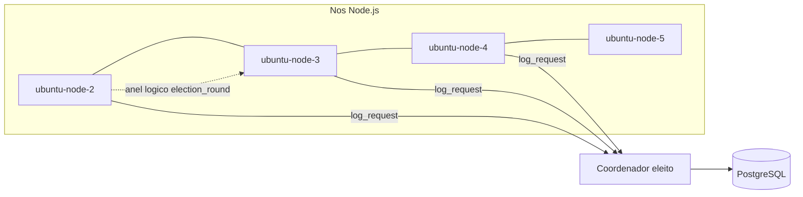

# 01 Visão e conceitos (sistemas distribuídos)

## Objetivo do laboratório

Simular uma rede de processos que:

1. **Elege um coordenador** usando mensagens em **anel lógico**.
2. **Serializa acesso** a um recurso compartilhado via **exclusão mútua centralizada** (só o coordenador grava).
3. **Reage a falhas simplificadas** (timeout de resposta do coordenador) tentando nova eleição.

O enunciado típico de TP pede gravação em arquivo; esta implementação persiste em PostgreSQL (`log_entries`). Ver [decision-register.md](../decision-register.md).

## Componentes

- **Transporte entre nós:** Socket.IO sobre HTTP (portas `3002`–`3005`).
- **Recurso compartilhado:** tabela `log_entries` (hostname + timestamp).
- **Orquestração:** Docker Compose, rede bridge com IPs fixos.

## Glossário

| Termo | No lab |
| --- | --- |
| **Processo / nó** | Container `ubuntu-node-x` executando `DistributedNode` |
| **Identificador** | `NODE_PORT` (3002–3005); maior porta → preferência de líder entre participantes da eleição |
| **Anel lógico** | Cada nó encaminha `election_round` ao **sucessor** (próximo IP/porta na ordem, com wrap) |
| **Coordenador / líder** | Nó com `isCoordinator === true`; único que aceita `log_request` e grava no banco |
| **Exclusão mútua centralizada** | Clientes pedem ao coordenador; ele processa **um** `INSERT` por vez (fila + flag) |
| **Detecção de falha (simplificada)** | Cliente espera `log_response-{requestId}` por 10s; se expirar, emite `Disconnect` e nova eleição |

## O que este TP ilustra na disciplina

- Comunicação **assíncrona** por mensagens (sem memória compartilhada entre nós).
- **Eleição de líder** e **papel especial** do coordenador.
- **Mutex** em arquitetura **centralizada** (vs. token ring distribuído).
- Trade-off: simplicidade didática vs. robustez de produção (partição, consenso, SPOF do banco).

Limitações explícitas: [12_invariantes_e_limites.md](12_invariantes_e_limites.md). Comparação com algoritmos de livro: [references/comparacao_algoritmos.md](../references/comparacao_algoritmos.md).

## Fundamentação bibliográfica

| Conceito no TP | Fonte (BibTeX) | No código |
| --- | --- | --- |
| Sistema distribuído por mensagens | `tanenbaum2023ds` cap. intro, comunicação | Socket.IO entre nós |
| Coordenador / líder | `garcia1982elections`, `chang1979extrema` | `isCoordinator`, eleição |
| Recurso compartilhado | `tanenbaum2023ds` | PostgreSQL `log_entries` |
| Mutex centralizado | `velazquez1993survey` | Fila no coordenador |

Leitura: [16_fundamentacao_bibliografica.md](16_fundamentacao_bibliografica.md), PDFs em [references/README.md](../references/README.md).

## Arquivos principais

| Caminho | Papel |
| --- | --- |
| `docker-compose.yml` | Topologia e variáveis por nó |
| `src/server/application/NodeApplication.js` | Lógica distribuída |
| `src/server/main.js` | Entrada do processo |
| `tabela.sql` | DDL inicial |
