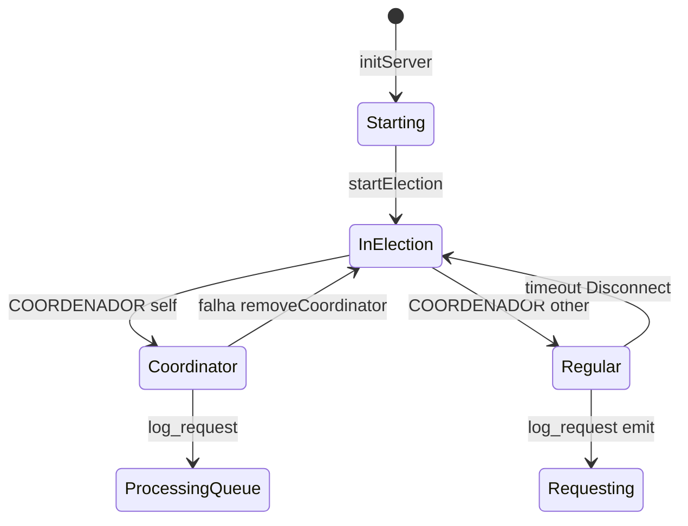

# 04 Módulo DistributedNode

Arquivo: [`src/server/DistribuitedNode.js`](../../src/server/DistribuitedNode.js) (classe `DistributedNode`).

## Constantes de tempo

| Constante | Valor | Uso |
| --- | --- | --- |
| `MIN_INTERVAL` | 15000 ms | Intervalo do ciclo de requisições aleatórias |
| `MAX_INTERVAL` | 25000 ms | Escala do atraso aleatório antes de cada `log_request` |
| `TIMEOUT_LIMIT` | 10000 ms | Espera por `log_response-{requestId}` |

Outros delays no código: 5s após `listen` antes da eleição; 5s entre itens da fila; 15s ao processar `COORDENADOR`; 80s após `Disconnect` antes de `connectToRing`; 5s antes de conectar ao coordenador como nó regular.

## Estado da instância

| Campo | Tipo / papel |
| --- | --- |
| `hostname`, `localIp`, `port` | Identidade do nó (env) |
| `io`, `server` | Socket.IO servidor |
| `ipList` | Mapa ordenado `{ [NODE_PORT]: IP }` |
| `successorIp`, `successorSocket` | Sucessor no anel lógico |
| `coordinatorIp`, `isCoordinator` | Líder atual |
| `inElection`, `electionList` | Eleição em andamento |
| `requestQueue`, `queueLimit` (6), `isProcessing` | Fila do coordenador |
| `dbPool` | Pool `pg` (só coordenador após `connectToDatabase`) |

## Mapa método → responsabilidade

| Método | Responsabilidade |
| --- | --- |
| `initServer` | Listen, handlers Socket.IO, eleição inicial |
| `electSuccessor` | Primeiro peer com `port > this.port`, senão wrap no menor |
| `getSuccessor` | Reutiliza ou reconecta sucessor |
| `removeSuccessor` | Fecha socket do sucessor |
| `removeCoordinator` | Limpa papel de coordenador / remove IP da lista se necessário |
| `reconnect` | Reinsere nó na `ipList` por porta |
| `connectToRing` | Anuncia presença com evento `reconnect` |
| `startElection` | Máquina de estados da eleição |
| `setupCoordinatorServer` | `connectToDatabase` |
| `setupRegularNodeServer` | Cliente Socket.IO ao coordenador + `initiateRandomRequests` |
| `connectToDatabase` / `disconnectFromDatabase` | Pool PostgreSQL |
| `initiateRandomRequests` | Loop de `log_request` e timeout |
| `addToQueue` / `processNextInQueue` / `processRequest` | Mutex centralizado |

## Fluxo de papéis

Detalhes de eleição: [05_eleicao_em_anel.md](05_eleicao_em_anel.md). Mutex: [06_exclusao_mutua_centralizada.md](06_exclusao_mutua_centralizada.md).
