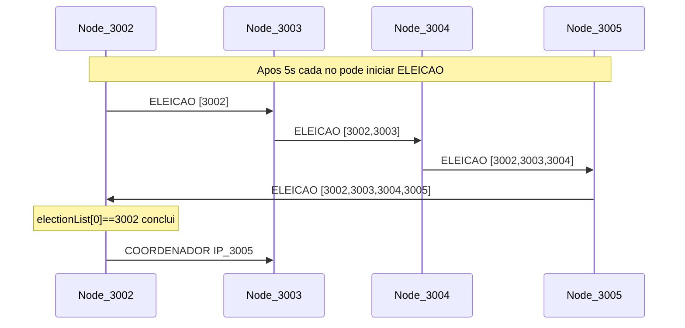

# 05 Eleição em anel

## Sucessor no anel lógico

Ordem dos nós: `ipList` ordenada por chave (porta). Para o nó local com `this.port`:

1. Percorre IPs e escolhe o **primeiro** com `getClientPort(ip) > this.port`.
2. Se nenhum, conecta ao **primeiro** da lista (wrap).

Implementação: `electSuccessor`, `getSuccessor`.

Exemplo no compose padrão:

| Nó | Porta | Sucessor |
| --- | --- | --- |
| ubuntu-node-2 | 3002 | 3003 |
| ubuntu-node-3 | 3003 | 3004 |
| ubuntu-node-4 | 3004 | 3005 |
| ubuntu-node-5 | 3005 | 3002 |

## Mensagem ELEICAO

- **Payload:** array de portas (`electionList`) — participantes que já se incluíram na rodada.
- Cada nó que entra na eleição:
  - Define `inElection = true`, chama `removeCoordinator()`.
  - Adiciona `this.port` à lista.
  - Emite `ELEICAO` ao sucessor com a lista atualizada.

### Condições em `startElection`

1. **Entrada normal:** nó ainda não está na lista e (`electionList` vazio **ou** `electionList[0] > this.port`) → participa e repassa.
2. **Reinício:** não está em eleição, não está na lista, e `electionList[0] < this.port` → zera lista, coloca só a própria porta, repassa (comportamento tipo “bully” simplificado).
3. **Conclusão:** `electionList[0] === this.port` (mensagem voltou ao iniciador):
   - `coordinatorPort = Math.max(...electionList)`
   - `coordinatorIp = ipList[coordinatorPort]`
   - Se local é líder: `setupCoordinatorServer()`
   - Propaga `COORDENADOR` ao sucessor e conexões diretas aos demais nós.

### Critério de líder

Entre os processos listados na rodada, vence a **maior porta** (`NODE_PORT`). No cluster padrão de quatro nós, o líder estável é **ubuntu-node-5** (3005), se todos participam.

## Mensagem COORDENADOR

- **Payload:** `{ coordinator: IP, processList?: electionList }`
- Receptores aguardam **15 segundos** antes de aplicar (delay fixo no handler).
- Atualizam `coordinatorIp`, limpam `inElection` / `electionList`.
- Se `coordinator === localIp` → coordenador; senão → `setupRegularNodeServer()`.

## Boot

Após `server.listen`, **todos** os nós esperam 5s e chamam `startElection([])` — eleições concorrentes no início; o sistema converge quando as mensagens completam o anel.

(Diagrama ilustrativo; a ordem exata depende de quem inicia e dos ramos de `startElection`.)

## Reintegração: reconnect

Nó que voltou emite `reconnect` com `{ port }`. Pares atualizam `ipList`. Se o vizinho imediato na porta (`port + 1`) reconecta, o sucessor pode reemitir `COORDENADOR` — ver `reconnect()` no código.

## Relação com a teoria

Este protocolo **não** é a implementação literal de Chang–Roberts; acumula participantes e usa `max(port)`. Ver [references/comparacao_algoritmos.md](../references/comparacao_algoritmos.md).

Eventos: [07_contrato_socket_io.md](07_contrato_socket_io.md).

## Fundamentação bibliográfica

| Aspecto | Literatura (`chang1979extrema`, `dtu2017elections`) | Implementação | Gap |
| --- | --- | --- | --- |
| Circulação no anel | Mensagem passa ao sucessor com ID(s) | `ELEICAO` + `electSuccessor` | Lista de portas, não só max UID (**B-CR1**) |
| Líder | Maior identificador | `Math.max(...electionList)` | Alinhado no critério final |
| Anúncio | Mensagem `elected` circula | `COORDENADOR` + delay 15s | **B-ELEC1** |
| Complexidade | O(n log n) C&R vs O(n²) Le Lann | n=4 fixo | Ver [utexas_lcr_notes](../references/notas/utexas_lcr_election_notes.md) |

Notas: [chang1979_ring_election.md](../references/notas/chang1979_ring_election.md), [dtu2017_distributed_elections.md](../references/notas/dtu2017_distributed_elections.md).
