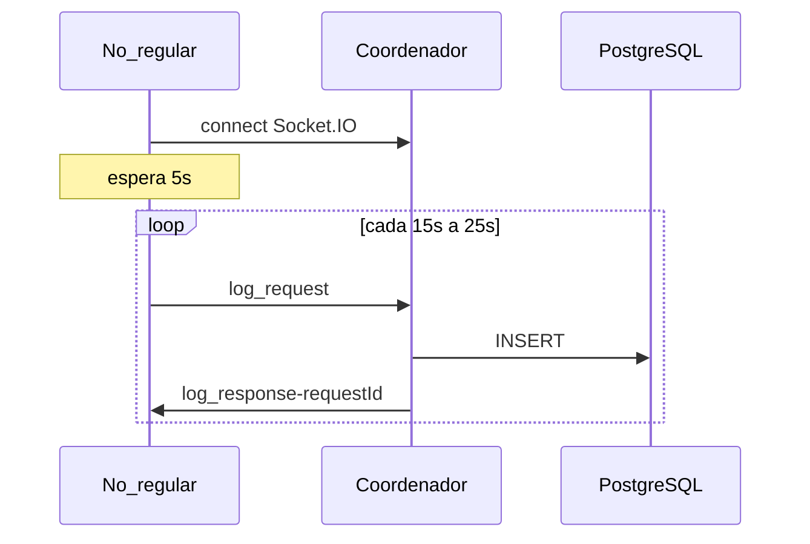

# 11 Fluxo ponta a ponta

Linha do tempo típica com quatro nós saudáveis e Postgres ativo.

## Fase 1 — Subida (T ≈ 0)

1. `docker compose up` cria rede, Postgres (healthcheck OK), pgAdmin, quatro containers.
2. Cada processo: `main.js` → `initServer()` → listen na `NODE_PORT`.
3. `ipList` montada a partir de `IP_LIST`.

## Fase 2 — Eleição inicial (T ≈ +5s)

4. Cada nó chama `startElection([])` independentemente.
5. Mensagens `ELEICAO` circulam no anel; listas de portas crescem.
6. Quando a lista retorna ao iniciador da rodada, calcula-se `max(porta)` → IP do coordenador (tipicamente **172.25.0.5:3005**).
7. Propagação `COORDENADOR` a todos os nós.
8. Após delay de 15s no handler, nós regulares entram em `setupRegularNodeServer`; coordenador chama `connectToDatabase`.

## Fase 3 — Operação estável

9. Nó regular conecta cliente ao `coordinatorIp:port`.
10. Loop: a cada ~15s, agenda `log_request` com atraso aleatório até 25s.
11. Coordenador enfileira, processa um `INSERT`, aguarda 5s, processa próximo.
12. Cliente registra sucesso no log ou dispara timeout em 10s.

## Fase 4 — Falha percebida do coordenador (opcional)

13. Cliente não recebe `log_response` em 10s.
14. Cliente emite `Disconnect` e `startElection([])`.
15. Nós afetados limpam coordenador, esperam 80s, anunciam `reconnect`.
16. Nova rodada de eleição; novo coordenador (maior porta entre participantes vivos).
17. Ciclo retorna à fase 3.

## Onde ler cada trecho

| Fase | Documento |
| --- | --- |
| 1–2 | [05_eleicao_em_anel.md](05_eleicao_em_anel.md), [02_infra_docker_compose.md](02_infra_docker_compose.md) |
| 3 | [06_exclusao_mutua_centralizada.md](06_exclusao_mutua_centralizada.md), [09_persistencia_postgres.md](09_persistencia_postgres.md) |
| 4 | [10_falhas_e_recuperacao.md](10_falhas_e_recuperacao.md) |

Primeiro contato operacional: [00_quickstart.md](00_quickstart.md).
