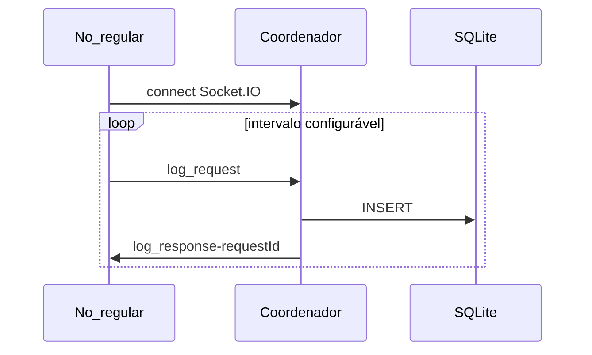

# 11 Fluxo ponta a ponta

Linha do tempo típica com quatro nós saudáveis.

## Fase 1 — Subida

1. `docker compose up` — quatro containers, volume `data/log.db`.
2. `bootstrap/main.js` → `NodeApplication.start()` → listen na `NODE_PORT`.
3. `RingTopology` a partir de `IP_LIST`.

## Fase 2 — Eleição inicial

4. Nó de **menor porta** chama `startElection([])` quando o sucessor conecta.
5. `election_round` circula; `max(porta)` define o coordenador (tipicamente **3005**).
6. `coordinator_announce` com `epoch` propaga-se pelo anel sem delay.
7. Coordenador abre SQLite; regulares conectam e iniciam `log_request`.

## Fase 3 — Operação estável

Fila serializa gravações; arquivo visível em `data/log.db` no host.

## Fase 4 — Falha do coordenador

Timeout 10s → `coordinator_suspect` → debounce → nova eleição em segundos.

| Fase | Documento |
| --- | --- |
| 1–2 | [05](05_eleicao_em_anel.md), [02](02_infra_docker_compose.md) |
| 3 | [06](06_exclusao_mutua_centralizada.md), [09](09_persistencia_sqlite.md) |
| 4 | [10](10_falhas_e_recuperacao.md) |

[00_quickstart.md](00_quickstart.md).
