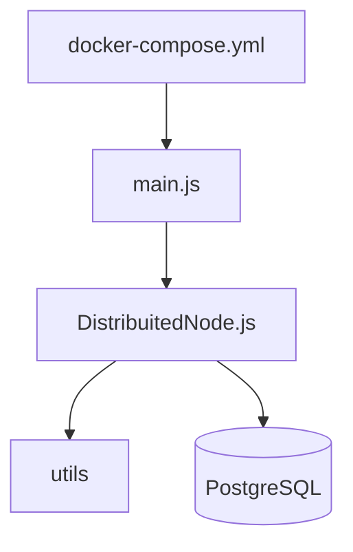

# 14 Arquitetura e manutenção

## Mapa “onde editar”

| Objetivo | Arquivo(s) | Doc |
| --- | --- | --- |
| Adicionar/remover nó no cluster | `docker-compose.yml`, `IP_LIST` em cada serviço | [02](02_infra_docker_compose.md), [appendix_variaveis](appendix_variaveis_ambiente.md) |
| Mudar critério de líder | `DistribuitedNode.js` → `startElection` | [05](05_eleicao_em_anel.md), [decision-register](../decision-register.md) |
| Mudar ordem do anel | `electSuccessor`, `ipList` | [05](05_eleicao_em_anel.md) |
| Novo evento Socket.IO | `initServer` handlers + emissores | [07](07_contrato_socket_io.md) |
| Política da fila (tamanho, delay) | `queueLimit`, `processRequest` setTimeout | [06](06_exclusao_mutua_centralizada.md) |
| Credenciais / host DB | `connectToDatabase`, `tabela.sql`, compose | [09](09_persistencia_postgres.md) |
| Timeout cliente | `TIMEOUT_LIMIT`, `initiateRandomRequests` | [10](10_falhas_e_recuperacao.md) |
| Regra IP↔porta | `utils/IpsToObjectSorted.js`, `GetClientPort.js`, `reconnect` | [08](08_utilitarios.md) |
| Imagem do container | `src/Dockerfile`, `package.json` | [03](03_entrypoints_e_build.md) |

## Dependências conceituais

Alterar `IP_LIST` sem atualizar `IpsToObjectSorted` / `reconnect` quebra eleição e reconexão.

## Convenções do repositório

- Classe exportada: `DistributedNode`; arquivo legado: `DistribuitedNode.js` (typo no nome do arquivo — renomear é backlog).
- Não referenciar caminhos de meta-workspace no código ou em `docs/` do repo.

## Checklist após mudança

1. Atualizar doc na matriz de [docs/README.md](../README.md).
2. `docker compose config` e smoke test `docker compose up`.
3. Registrar decisão em [decision-register.md](../decision-register.md) se mudar comportamento observável.
4. Gate: [15_testes_e_gate.md](15_testes_e_gate.md).
