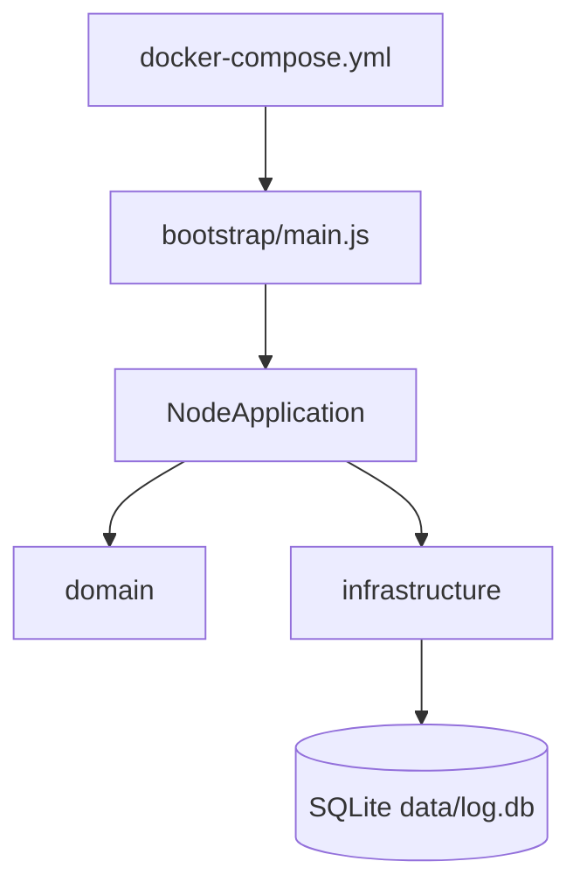

# 14 Arquitetura e manutenção

## Mapa “onde editar”

| Objetivo | Arquivo(s) | Doc |
| --- | --- | --- |
| Adicionar/remover nó no cluster | `docker-compose.yml`, `IP_LIST` | [02](02_infra_docker_compose.md) |
| Critério de líder | `ElectionService`, `NodeApplication.startElection` | [05](05_eleicao_em_anel.md) |
| Topologia do anel | `domain/ring/RingTopology.js` | [05](05_eleicao_em_anel.md) |
| Novo evento Socket.IO | `NodeApplication.onPeerConnection` | [07](07_contrato_socket_io.md) |
| Fila do coordenador | `domain/coordinator/RequestQueue.js` | [06](06_exclusao_mutua_centralizada.md) |
| SQLite | `SqliteLogRepository`, `schema.sql`, `DATABASE_PATH` | [09](09_persistencia_sqlite.md) |
| Timeout cliente | `config/env.js` | [10](10_falhas_e_recuperacao.md) |
| Imagem do container | `src/Dockerfile`, `package.json` | [03](03_entrypoints_e_build.md) |

## Dependências conceituais

## Convenções

- Código em camadas: `domain/`, `application/`, `infrastructure/`, `config/`.
- Não referenciar caminhos de meta-workspace no código ou em `docs/` do repo.

## Checklist após mudança

1. Atualizar doc na matriz de [docs/README.md](../README.md).
2. `docker compose config` e smoke `docker compose up`.
3. Registrar decisão em [decision-register.md](../decision-register.md) se mudar comportamento observável.
4. Gate: [15_testes_e_gate.md](15_testes_e_gate.md).
