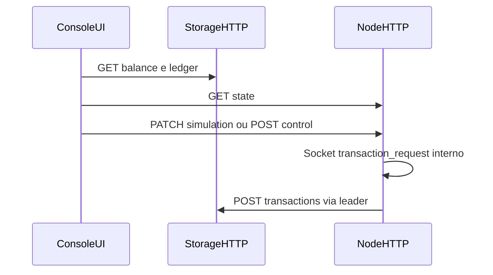

# 03 Modelo de dados e fontes

## Resumo

Define de onde a UI obtém dados e intervalos de atualização. v1 usa **polling HTTP** (sem SSE/WebSocket).

## Pré-requisitos

- [09-api-http-controle-v1.md](../finalizacao-backend-operacao/09-api-http-controle-v1.md)

## Diagrama



## Fontes

| Dado | Fonte | Intervalo sugerido |
| --- | --- | --- |
| Saldo | `GET /v1/balance` | 1 s |
| Ledger rows | `GET /v1/ledger?limit=50&afterId=` | 1 s (cursor `afterId` = último id) |
| Timeline (log global) | `GET /v1/timeline-events?limit=100&afterId=` | 1 s |
| Estado nó | `GET /v1/state` por porta | 2 s |
| Cluster | `GET /v1/cluster/state` (um bootstrap nó) | 5 s |

## Tipos TypeScript (resumo)

```typescript
type Balance = { balance: string; balanceCents: number };
type LedgerEntry = {
  id: number;
  entry_type: "txn" | "admin";
  request_id: string;
  host_name: string;
  node_name: string;
  delta_cents?: number;
  balance_after_cents: number;
  created_at_ms: number;
};
type SimulationConfig = {
  mode: string;
  txEnabled: boolean;
  txBurst: number; // demo orgânica: sempre 1
  txIntervalMs: number;
  txIntervalSec: number; // preferir no select da UI
  txJitterMs: number;
  killEnabled: boolean;
  killIntervalMs: number;
  deltaMode: string;
  paused: boolean;
};
type NodeState = {
  port: number;
  isCoordinator: boolean;
  coordinatorPort: number | null;
  storageUp: boolean;
  simulation: SimulationConfig;
  paused: boolean;
};
```

## Configuração de alvos

`frontend/.env.development`:

```bash
VITE_STORAGE_URL=http://localhost:4000
VITE_NODE_HTTP_PORTS=4002,4003,4004,4005
```

LAN multi-host:

- `VITE_STORAGE_URL=http://<IP-storage-host>:4000` (fixo no observador central ou documentado para todos os operators).
- Lista de nós: agregar `GET /v1/state` em cada peer conhecido — futuro `GET /v1/cluster/peers` em qualquer nó após discovery; até lá, configurar `VITE_NODE_HTTP_BASES` ou scan de portas documentado no cap. 14.

## Log panel

Fonte primária: **`GET /v1/timeline-events`** (mensagem PT-BR em `message`, código em `event_code`, origem em `lab_host_name` / `node_name`).

Complemento: ledger `txn`/`admin` para coluna de saldo; `GET /v1/state` para destaque de líder atual.

Appendix: [appendix-mapeamento-log-ui.md](appendix-mapeamento-log-ui.md).

## Decisões

- Polling simples; backoff se storage 503.
- Ledger table cresce no cliente (append); limitar 500 linhas em memória com trim.

## Critérios de aceite

- [ ] Diagrama e tabela de fontes completos.
- [ ] Estratégia log sem docker logs documentada.

## Fora de escopo

- WebSocket tail de logs centralizado (backend P9 opcional).
