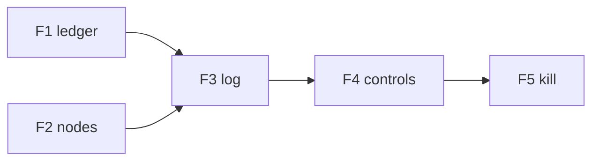

# 09 Fases de implementação (frontend)

## Resumo

Ordem de entrega do console após backend P4 (API controle mínima) ou paralelo com leitura-only.

| Fase | Entrega | Depende backend |
| --- | --- | --- |
| F1 | Scaffold Vite+React; BalanceHeader; polling balance+ledger; LedgerTable | GET storage |
| F2 | NodeGrid + GET state; destaque líder | `/v1/state` |
| F3 | LogPanel (derivado ledger + diff coordinator) | F1–F2 |
| F4 | ControlDrawer: PATCH simulation, pause, tx manual | API controle |
| F5 | Kill manual + preset demo; erros UX | POST leader-kill |
| F6 | LAN: config multi-host; doc operador | discovery LAN |
| F6b | **Modo observador central:** storage + grid multi-`LAB_HOST_NAME` (LAN) | F1–F2 |
| F7 | Build estático + nota em `18_console_lab.md` | — |

## Critérios de aceite

- [ ] Fases mapeadas a [10-checklist-aceite-frontend.md](10-checklist-aceite-frontend.md).

## Fora de escopo

- Publicar em GitHub Pages.
