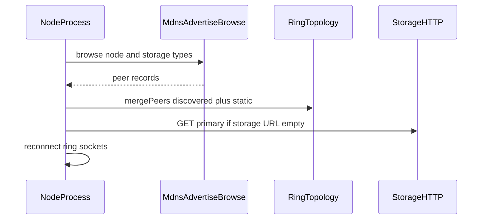

# 05 Descoberta LAN automática

## Resumo

Especifica descoberta **zeroconf (mDNS)** para nós e storage na mesma Wi‑Fi, merge de membership no anel, integração com primário/standby existente e fallback manual. Atende ao requisito de 2 PCs “se reconhecerem” sem editar `CLUSTER_PEERS` em cada boot.

## Pré-requisitos

- [04-lab-env-perfis.md](04-lab-env-perfis.md)
- [08-caminho-escrita-leitura-invariantes.md](08-caminho-escrita-leitura-invariantes.md)

## Decisões e invariantes

- **DEVE** existir `DISCOVERY_MODE=manual|mdns|off`; em LAN recomendado `mdns`.
- Anúncio **DEVE** incluir: `labHostName`, `role` (`node`|`storage`), `socketPort`, `httpPort`, `advertiseHost`, `storageMode` (se storage).
- Merge de peers **DEVE** ser determinístico: ordenar por `host:port`, deduplicar por porta.
- **NÃO DEVE** criar segundo primário ledger se `GET /v1/storage/primary` já responde com primário vivo (reusar lógica standby).
- Discovery **NÃO** garante consistência sob partição de rede (lab only).

## Comportamento esperado

### Fluxo boot (nó, mDNS)

1. Ao subir, publicar registro mDNS em `ADVERTISE_HOST:NODE_PORT` (TXT metadata).
2. Browser escuta peers; a cada `DISCOVERY_POLL_MS`, atualiza mapa interno.
3. Se `STORAGE_URL` vazio e registro storage encontrado → definir `STORAGE_URL` e `refreshStorageHealth`.
4. Chamar `RingTopology.mergeDiscoveredPeers(peers)` e reconectar sucessor se mudou.
5. Opcional: `GET http://<peer-http>/v1/cluster/state` para `coordinatorPort` e `epoch` (alinhar com join tardio).

### Fluxo boot (storage primary)

1. Subir HTTP storage; publicar mDNS `_ring-storage-lab._tcp`.
2. Registrar `storage_meta` local como hoje.

### Fallback manual

- `DISCOVERY_MODE=manual`: só `CLUSTER_PEERS` + `BOOTSTRAP_PEER` (comportamento atual melhorado com HTTP cluster state).
- `off`: Docker fixo 172.25.0.x.

### Firewall

Documentar para Windows e Linux: liberar UDP 5353 (mDNS), TCP portas 3002+, 4000, HTTP nó (4002+).

### WSL2 / Docker

- **Invariante lab:** em teste 2 PCs, preferir nó rodando com `ADVERTISE_HOST` = IP da interface Wi‑Fi do Windows/Linux host, não IP interno Docker-only, **ou** `network_mode: host` no perfil LAN (decisão na implementação — registrar em DR-008).
- Plano **recomenda** teste LAN com `npm run server` no host ou compose com `ADVERTISE_HOST` explícito.

## LAN multi-host (normativo)

- **Peers:** mDNS une hosts na mesma rede; participants **não** precisam editar `CLUSTER_PEERS`.
- **Storage:** todos usam **`STORAGE_URL` fixo** no [lab.env.example](../../../lab.env.example). mDNS de storage **não** substitui essa URL se já definida.
- **Líder:** não é “descoberto”; surge da eleição após merge — pode estar em **qualquer** host (`LAB_HOST_NAME` + `HOSTNAME` + porta).
- **Storage host entra/sai:** `DISCOVERY_POLL_MS` + health periódico; txs descartadas **não** reenviam — ver [14-cenario-lan-multi-host.md](14-cenario-lan-multi-host.md).

## Módulos alvo (implementação)

| Path | Responsabilidade |
| --- | --- |
| `src/server/infrastructure/discovery/MdnsDiscoveryAdapter.js` | browse + advertise (ex. `bonjour-service` ou multicast-dns) |
| `src/server/application/DiscoveryCoordinator.js` | merge, timers, callbacks para `NodeApplication` |
| `src/server/application/StorageReachabilityMonitor.js` | health periódico, evento `STORAGE_RECOVERED` |
| `src/server/domain/ring/RingTopology.js` | `mergeDiscoveredPeers` |
| `src/storage/` | opcional advertise storage separado |

## DR-008 (rascunho)

Copiar para [decision-register.md](../../decision-register.md) na fase código:

> **DR-008 — Compose único e descoberta mDNS no lab LAN**  
> **Data:** (preencher)  
> **Contexto:** Operar 2+ PCs na Wi‑Fi sem manter `CLUSTER_PEERS` manualmente; um único `docker-compose.yml` com perfis via `lab.env`.  
> **Decisão:** Usar mDNS (DNS-SD) com tipos `_ring-coordinator-lab._tcp` e `_ring-storage-lab._tcp` para anúncio de nós e storage; merge de peers no processo; fallback `DISCOVERY_MODE=manual`. Storage primário único; candidatos extras em standby via discovery HTTP existente.  
> **Consequências:** Dependência npm de biblioteca mDNS; cuidado com WSL2/Docker — `ADVERTISE_HOST` deve ser alcançável na LAN. Não é mecanismo de consenso.  
> **Alternativas rejeitadas:** Somente `BOOTSTRAP_PEER`; broadcast UDP custom sem padrão; etcd/consul.
>
> **LAN:** mesmo com mDNS, participants **devem** configurar `STORAGE_URL` com IP fixo do storage host para previsibilidade; mDNS não substitui essa URL.

## Critérios de aceite

- [ ] Dois PCs na mesma Wi‑Fi com `DISCOVERY_MODE=mdns` formam anel e transacionam sem editar `CLUSTER_PEERS`.
- [ ] Apenas um primário ledger ativo; segundo storage vira standby (log visível).
- [ ] `DISCOVERY_MODE=manual` continua funcionando para debug.

## Riscos

| Risco | Mitigação |
| --- | --- |
| mDNS bloqueado no roteador | Checklist rede; fallback manual |
| IPs incorretos no Docker | Perfil host network ou processo no host |
| Peer spoofing na LAN | Lab trusted network; token storage write |

## Fora de escopo

- Service discovery em nuvem; Consul; Kubernetes DNS.
