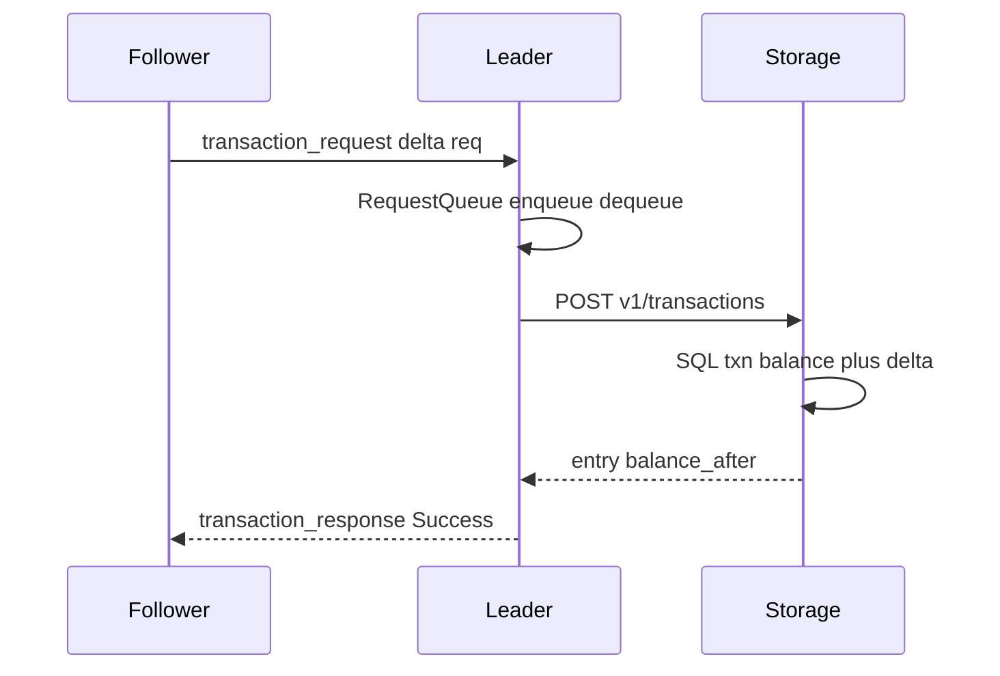
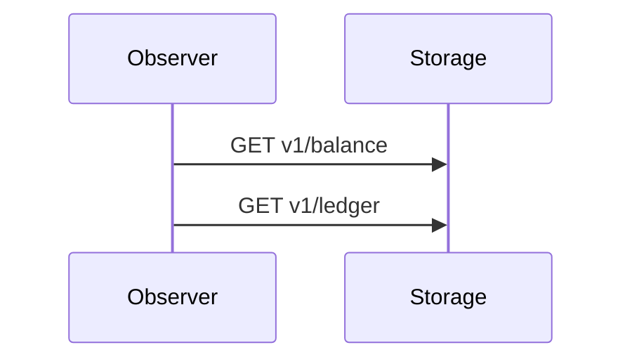

# 08 Caminho de escrita, leitura e invariantes

## Resumo

Reafirma o modelo **delta + mutex centralizado + storage atômico** e distingue leitura (storage direto) de escrita (via líder). Responde à dúvida “quem calcula o saldo”: o **storage**, não cada máquina.

## Pré-requisitos

- [documentation/06_exclusao_mutua_centralizada.md](../../documentation/06_exclusao_mutua_centralizada.md)
- [simulacao-lan-ledger/08-caminho-escrita-fila.md](../simulacao-lan-ledger/08-caminho-escrita-fila.md)

## Decisões e invariantes

- Follower **NÃO** lê saldo para montar transação simulada (apenas delta aleatório ou valor fixo enviado por API/UI).
- Líder **NÃO** mantém saldo em memória como fonte da verdade; opcional cache read-only inválido após apply.
- Storage **DEVE** aplicar `balance_cents + delta_cents` em transação SQLite única.
- Leitura para dashboard **DEVE** usar `GET /v1/balance` e `GET /v1/ledger` no storage, sem passar pelo líder.
- Conflitos de concorrência **resolvem-se** pela fila do líder (ordem total de writes), não por merge no cliente.

## Sequência de escrita

## Leitura

Opcional no nó: `LOG_READS` + `performRead()` — não altera escrita.

## Storage host offline

- Anel entre **participants** pode permanecer ativo (peers mDNS já conhecidos).
- `STORAGE_URL` aponta para o storage host → `storageUp=false` → líder descarta.
- Quando o storage host religa **apenas o serviço de ledger**, health recupera; anel não precisa ser reconstruído manualmente (após P5/P9).
- Detalhes: [14-cenario-lan-multi-host.md](14-cenario-lan-multi-host.md), matriz [15-matriz-cenarios-operacao.md](15-matriz-cenarios-operacao.md).

## Modelo rejeitado (documentar para banca)

“Cada máquina lê, calcula e manda saldo novo” → exige versão, comparador no líder ou locks distribuídos; **fora do escopo** do lab mutex centralizado.

## Critérios de aceite

- [ ] Código mantém apply apenas em `LedgerDatabase.applyTransaction`.
- [ ] Plano front não sugere POST transação direto no storage pelo browser.

## Fora de escopo

- Operações de débito condicional (if balance > x).
