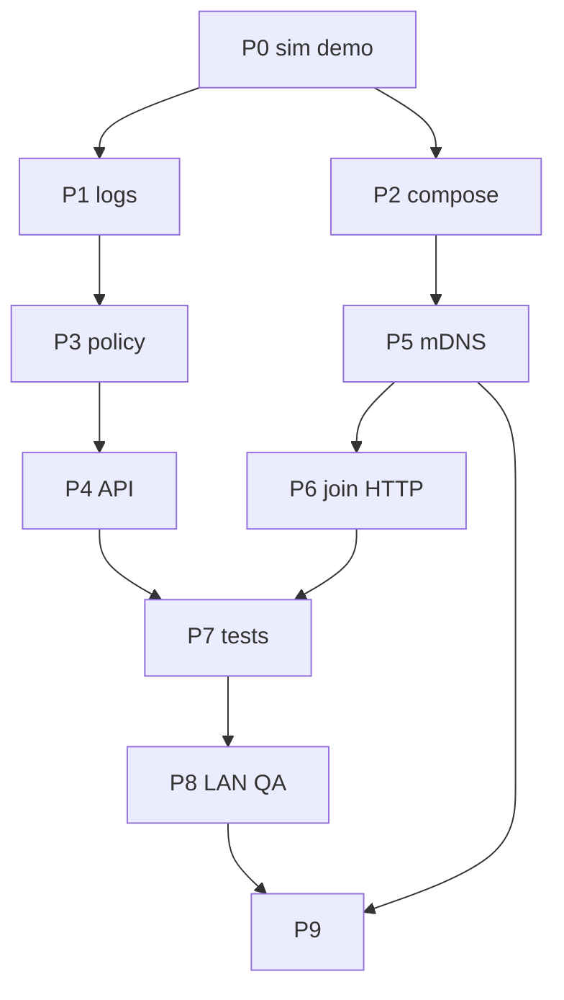

# 12 Fases de implementação (backend)

## Resumo

Ordem sugerida de PRs/commits ao **executar** este plano (não confundir com a meta-fase de só escrever docs).

## Fases

| Fase | Entrega | Depende |
| --- | --- | --- |
| P0 | Defaults demo em `lab.env`, `SIM_TX_BURST`, runner burst, `auto`+25s kill | — |
| P1 | Logs `req=` + `LOG_SIM` | P0 |
| P2 | Compose único; remover `docker-compose.lan.yml`; gate env-file | P0 |
| P3 | `SimulationPolicy` + extrair trechos de `NodeApplication` | P1 |
| P4 | API controle v1 + CORS storage GET | P3 |
| P5 | mDNS discovery + merge topology | P2 |
| P6 | Join HTTP `cluster/state` no bootstrap | P5 |
| P7 | Testes Jest novos | P1–P5 |
| P8 | Checklist 2 PCs executado; DR-008 no register; docs canônicas | P7 |
| P9 | Playbook LAN: profiles `storage`/`nodes`, `lab.env.example` único, validação multi-PC, `StorageReachabilityMonitor` | P5, P8 |

## Critérios de aceite

- [ ] Cada fase mapeada a checklist [13-checklist-aceite-backend.md](13-checklist-aceite-backend.md).

## Fora de escopo

- Implementar frontend (pacote separado).
