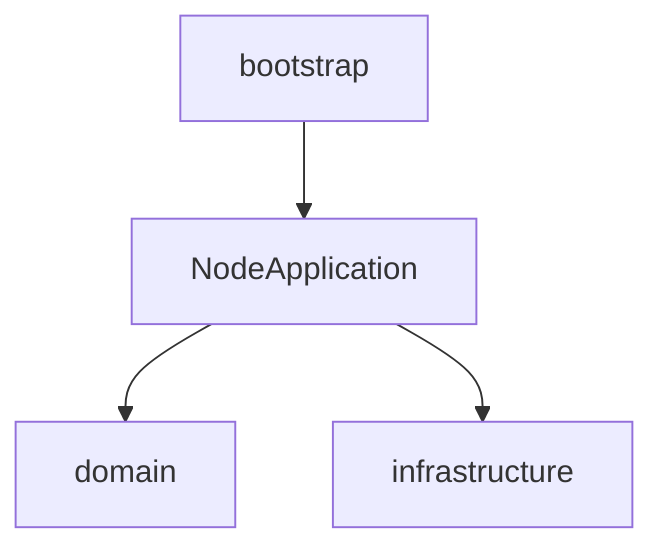

# 03 Arquitetura em camadas

## Pastas (`src/server/`)

| Camada | Responsabilidade |
| --- | --- |
| `config/` | Variáveis de ambiente e timeouts |
| `domain/` | Topologia, eleição, fila (regras puras) |
| `application/` | `NodeApplication` — orquestra ciclo de vida |
| `infrastructure/` | Socket.IO, SQLite |
| `bootstrap/` | Entrada e wiring |

## Princípios

- **SRP:** eleição, transporte e persistência separados.
- **DIP:** aplicação usa `LogRepository` e cliente de peer injetáveis nos testes.

Diagrama de dependência:

