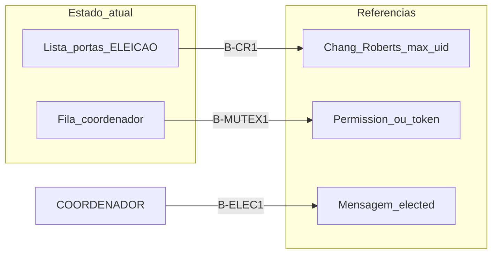

# Mapa literatura ↔ código

Tabela central: **fonte**, **documentação**, **código** e **gap** (itens de [engineering_backlog.md](../documentation/engineering_backlog.md)).

| Tópico | Fonte primária (BibTeX) | Doc técnica | Código (`DistribuitedNode.js`) | Gap / backlog |
| --- | --- | --- | --- | --- |
| Eleição em anel | `chang1979extrema`, `utexas_lcr_notes` | [05](../documentation/05_eleicao_em_anel.md), [07](../documentation/07_contrato_socket_io.md) | `startElection`, `electSuccessor`, `getSuccessor` | **B-CR1** — lista de portas vs ID máximo na mensagem |
| Notificação do líder | `dtu2017elections` | [05](../documentation/05_eleicao_em_anel.md) | `COORDENADOR` emit/receive | **B-ELEC1** — delay 15s; sem `elected` formal |
| Sucessor no anel | `chang1979extrema` | [05](../documentation/05_eleicao_em_anel.md) | `electSuccessor` | OK no happy path; **B7** se rede morta |
| Mutex centralizado | `velazquez1993survey`, `tanenbaum2023ds` | [06](../documentation/06_exclusao_mutua_centralizada.md) | `addToQueue`, `processRequest` | **B-MUTEX1** — permission-based simplificado; **B2** handler |
| Recurso compartilhado | `tanenbaum2023ds` | [09](../documentation/09_persistencia_postgres.md) | `connectToDatabase`, SQL INSERT | **B8** SPOF Postgres |
| Falha + reeleição | `garcia1982elections` | [10](../documentation/10_falhas_e_recuperacao.md) | `initiateRandomRequests`, `Disconnect` | Sem asserções Garcia; **B5** sleeps |
| Partição / quorum | `garcia1985votes`, `ongaro2014raft` | [12](../documentation/12_invariantes_e_limites.md) | — | Sem consenso; split-brain possível |

## Roadmap de convergência (documentado; não implementado)

Ordem sugerida para aproximar o código das referências:

1. **B-CR1** — Eleição Chang–Roberts (mensagem com maior UID, descarte seletivo).
2. **B-ELEC1** + **B5** — Notificação `elected` sem delays arbitrários; timeouts derivados de modelo fail-stop.
3. **B-MUTEX1** — Manter coordenador central; corrigir **B2** e política de fila cheia.
4. Longo prazo — **Raft** (`ongaro2014raft`) somente se o TP evoluir para consenso replicado.

## Manutenção

Nova referência: entrada em `bibliografia.bib` + `notas/` + linha nesta tabela + matriz em [docs/README.md](../README.md).
